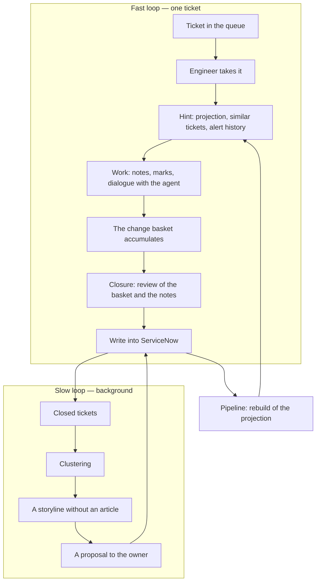
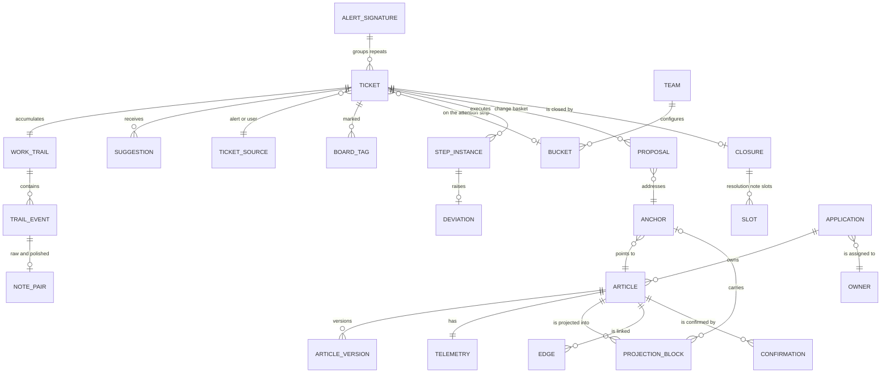
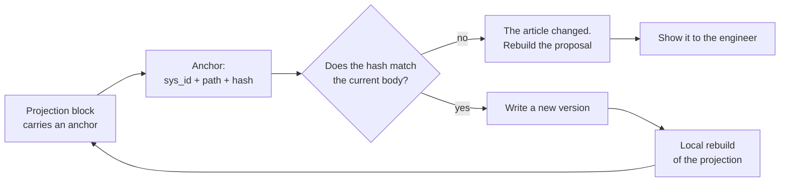

# The knowledge feedback loop in application support

A conceptual design of the interface and the interaction model. Edition 3.

Accompanied by a clickable mockup: `kb-loop-mockup-v3.jsx` — the main screen, the ticket workspace, closure.

---

## 1. Purpose of this document

The document describes what we are building for application support engineers and why exactly this way. The starting point is not the available APIs but the engineer's work on shift. The screens are derived from it, the entities from the screens, and the calls into ServiceNow from the entities.

Not in this document: the choice of technologies, the deployment diagram, a detailed API contract, effort estimates.

### What changed in the third edition

- The main screen is my tickets and the queue they are taken from. The board is demoted to a collapsible strip at the top.
- The set of buckets on the strip is a team setting rather than a shared constant: different teams have different handover times and a different rhythm.
- The closure screen is described as a review of the basket accumulated during the work, with the provenance of every slot stated.
- A confirmation screen after closure has been added.
- It is fixed that the card and the ticket are one object.

---

## 2. The person at the centre: what the engineer needs

Six needs on a shift. Against each — what does not work today.

**Understand what is going on.** In ten seconds one needs to see which application is affected, how serious it is and what is already known. Today this is a form of twenty fields of which three matter.

**Find out whether anyone has seen this before.** Knowledge is spread across three places: knowledge base articles, closed tickets, colleagues' heads. Search works poorly on the first, almost not at all on the second, and on the third it goes through a message into a chat and a wait.

**Understand whether what was found can be trusted.** An article without freshness signals is a lottery. Experienced people stop reading articles altogether, and the knowledge base dies not from poor content but from the impossibility of judging it.

**Have somewhere to put things as you go.** Notes on a ticket are rarely written today, mostly at handover to another team. Details, when written at all, go into the notes of Microsoft Planner cards — that is, outside ServiceNow entirely. This is a direct leak of knowledge, and its cause is that the card and the ticket are different objects today.

**Close without rewriting everything from scratch.** Resolution notes are reconstruction from memory without reward. The task is set wrongly: the person is asked for what the system could know by itself.

**Not lose context at handover.** A round-the-clock regime with rotating regions. Handover is done by hand in Planner. Tickets get stuck on people because any action requires going somewhere.

### The main decision

The engineer must be relieved of writing, not motivated to write better. All we want from them at the end is confirmation or refinement of ready text.

Since prose notes are hardly written today, we cannot rely on them. The basis of the draft is structural signals: step marks, the alert load and the history of its occurrences, changes within the incident window, the dialogue with the agent, state changes, the articles used. Prose is a useful addition.

Hence the framing: the notes field is offered to the engineer as their own scratchpad that turned out to be faster than a scratchpad. Not as a contribution to the knowledge base.

---

## 3. Scope of the pilot

**Team.** One global team working round the clock with rotating regions. The organisation has several groups, each with its own knowledge base and its own queues; they do not intersect. For the pilot — one team and one knowledge base.

**Scale.** About fifteen engineers per region. On a calm day, roughly five tickets per person. There is usually enough time to look at a ticket.

**Ticket types.** Incidents and universal requests. Service requests are not used at present.

**Ticket origin.** Infrastructure alerts from monitoring systems (BigPanda) — the state of systems and failed jobs; and requests from users. They require different things, see 5.6.

### What counts as success

1. The quality of resolution notes — the completeness of meaningful slots, not the volume of text.
2. The completeness of knowledge updates — the share of closures that produced a confirmation or a change.
3. The speed of closing — it must not get worse.
4. The discovery of stale articles — a consequence of the first three.

### What wins the engineer over

First — a screen on which it is convenient to work with one's own tickets, and a hint with understandable trust signals. Second — a draft of the resolution notes. Knowledge updating rides on top as a by-product.

### What we do not do

We do not chase feature parity with ServiceNow. We do not build a graph showcase. We do not introduce contribution counters and author ratings.

---

## 4. Design principles

**The interface never waits for the model.** A note appears instantly, before any processing. Classification, polishing and deviation detection run asynchronously and are drawn in later. If the model is unavailable, the work continues without hints. As soon as a wait of several seconds appears, half the value is lost.

**The engineer does not leave the work screen.** Switching between tickets changes the content, not the screen. The board, search and knowledge come to them, not the other way round.

**Peripheral vision is preattentive.** Peripheral information is numbers, dots, position, slight movement. As soon as text that has to be read appears there, focus is lost. Nothing pops up over the work.

**The card and the ticket are one object.** There is no separate place for details. What is written on the card is written in the ticket.

**Updating knowledge is a by-product of the work.** The engineer does not write an article, they review a ready change.

**The dialogue happens during the resolution, not after it.** Changes accumulate while the trail is hot.

**Passive signals matter more than active ones.** A "this step did not work" mark is worth more than any survey and costs zero attention.

**Interrupt in proportion to surprise.** If the course of the resolution matched the prediction, there is nothing to ask about.

**Show the basis, not a score.** A checkable fact instead of a hidden confidence number.

**Changes are additive by default.** An unconfirmed generalisation does not overwrite verified text.

**Evidence and knowledge are different entities.** Evidence lives on the ticket and is not carried into the knowledge base automatically.

**The projection is a function of the master.** Nothing reaches the projection bypassing ServiceNow.

---

## 5. The model of knowledge

### 5.1 Three sources and the invariant

| Source | What it is | Authority | How it reaches the projection |
|---|---|---|---|
| Knowledge base articles | `kb_knowledge`, curated by owners | Canonical | Through the pipeline |
| Closed tickets | Incidents and requests with resolution notes | Evidence | Only by being written up into an article |
| People's heads | Not digitised | Unknown | Through the feedback loop |

The invariant:

```
projection = f(master in ServiceNow)
```

Knowledge from tickets enters the work by two other paths.

**As a separate source in the hint.** The agent searches both the projection and closed tickets. The results are shown separately and labelled differently: "articles" and "similar tickets". Mixing them is not allowed — it undermines trust in the whole hint.

**As a stream of candidates.** A background process clusters closed tickets and looks for recurring storylines without an article. A cluster with evidence is offered to the application owner to be written up.

Both paths lead into ServiceNow, and only from there into the projection.

### 5.2 Article types and different confirmation loops

| Type | What it contains | How freshness is confirmed | At closure |
|---|---|---|---|
| Reference | Architecture, environments, owners, regulations | Not confirmed by tickets. The signal is CI changes and owner attestation | Does not participate |
| Fault procedure | Diagnosis and repair of a failure | By application on an incident | Review of deviations |
| Fulfilment procedure | Handling a request | By application on a universal request | Short confirmation |
| Interaction procedure | Working with the user, clarifications, routing | By application | Recording of conditions and branch points |

Reference articles age from the drift of reality, not from use. Deriving their freshness from closures is pointless.

Recurring alerts are the fastest path to coverage: they are deterministic, frequent, and allow one-press closing on a strong match.

### 5.3 The structure of a procedure

- **Applicability** — under which signs the procedure fits
- **Steps** — an ordered sequence
- **Branch points** — a condition and the alternatives
- **Verification** — how to make sure it helped
- **Observations** — unconfirmed additions from tickets

No more structure should be introduced: a strict typed format will kill authorship. The implementation is ordinary text with recognisable sections, formalised exactly enough for a change to address a specific block.

For interaction procedures, applicability and branch points matter more than steps. The most valuable knowledge there is the clarifying question that had to be asked.

### 5.4 Observations and promotion into the canon

Publishing without review. The role of the reviewer is played by the accumulation of confirmations.

```
A deviation during the work
        │
        ▼
An agent proposal ──► confirmation / correction / extension /
        │              creation / deprecation / link /
        │              not applicable
        ▼
Accepted by the engineer at closure
        │
        ├─ strong basis ──────► change of the canonical text
        │  (step mark + evidence)
        │
        └─ weak basis ────────► the "Observations" section
           (only a remark in the dialogue)   │
                                             ▼
                        two independent engineers on two tickets
                        OR one confirmation by the owner
                                             │
                                             ▼
                                    promotion into the canon
```

The threshold is calculated for the real volumes: with fifteen engineers and five tickets a day, three confirmations accumulate only for frequent procedures, while a rare procedure is applied twice a year. The application owner is an authority and needs no quorum.

Observations older than six months without movement go into a separate list on the owner's dashboard.

They are stored in the article body in ServiceNow, in a marked-up section. Keeping them only on our side is not allowed: within a year half of the living knowledge would end up outside the master.

### 5.5 Freshness and telemetry

Customising ServiceNow is not available; there will be no service fields on `kb_knowledge`. All telemetry lives on our side.

The boundary: **content in ServiceNow, telemetry on our side.**

Telemetry: the number of applications, confirmations with authorship and weight, the date of the last confirmation, deviations by step, co-occurrences of articles on the same ticket, not-applicable marks.

An accepted limitation: someone reading an article in the native ServiceNow interface sees no freshness signals.

Freshness is shown in words: "confirmed three days ago, applied 14 times". A hidden confidence number stops being believed.

### 5.6 Tickets from monitoring and from users

Origin is a first-class attribute that changes the composition of the hint.

**An alert from a monitoring system.** The most useful knowledge is usually not an article but a history: this alert fired fourteen times, in twelve cases the same thing was done, in two there was a real problem. There is a machine-readable payload by which repeats are matched precisely. The sources panel shows past occurrences first, articles second.

**A request from a user.** The signs are blurred. The valuable knowledge is which clarifying question to ask and where to route it. There may be no steps at all.

---

## 6. Two loops



### 6.1 The dialogue during the work

If the conversation with the agent happens only at closure, the engineer recalls things after the fact. A conversation along the way — "these steps do not fit", "look towards MQ", "this article is not about our case" — yields changes while the trail is hot.

As a result the closure screen stops being a place of creation and becomes a place where the accumulated basket is reviewed. Better on both priorities: quality is higher because the memory is fresh, and closing is faster because the work is already done.

A separate kind of signal, available only in the dialogue during the work: **not applicable**. It is not a correction of the text but a correction of the matching. It accumulates separately and improves the hint without touching the content.

### 6.2 The slow loop

Runs in the background over the mass of closed tickets. It provides the discovery of white spots and generalisation over many cases. The result goes to the application owner, not to the engineer: nobody will write up a new article during a shift.

### 6.3 The attention budget

| Situation | Behaviour |
|---|---|
| Strong match, the course of the resolution matched | A ready closure, one confirmation |
| Strong match, the course diverged | One pinpoint question |
| No match or a weak one | A full review, there is no short path |
| The article has not been confirmed for a long time | An explicit request for confirmation |
| A recurring alert with a stable history | An offer to close it as last time |

Splitting by seniority would be a mistake: a junior engineer on a familiar ticket should not have to write anything either.

### 6.4 Protection against formal confirmation

**A short path only on a strong prediction.** With a weak match there is none.

**Weights of signals, not punishment of people.** If a person's confirmations are regularly refuted by subsequent tickets, or the interval before confirmation is consistently below reading time, the weight of their confirmations is lowered. Quietly, without notifications.

**The question is not always asked.** Pinpointed by novelty plus a low-frequency random check.

**No contribution counters and no ratings.** If anything is to be shown to a person, it is "how many times your article helped others".

---

## 7. Screens

The first wave is one screen the engineer does not leave: the list of their tickets and the queue on the left, the workspace in the centre, the sources on the right. Above it a collapsible attention strip. Closure unfolds in the same place.

### 7.1 The main screen

```
┌───────────────────────────────────────────────────────────────────────┐
│ Attention board  ● Swarm 1        ● Needs attention 2   ● For APAC 1  │
├──────────────────────┬────────────────────────────────────────────────┤
│ In my work        2  │  INC0448213  FIX gateway latency, EMEA         │
│ ▸ INC0448213  P2     │  monitoring alert, fired 14 times              │
│   FIX GW latency     │                                                │
│ ▸ INC0448190  P3     │  [ workspace ]                                 │
│                      │                                                │
│ Waiting           2  │                                                │
│ ▸ REQ0091822         │                                                │
│ ▸ INC0448155         │                                                │
│                      │                                                │
│ ───────────────────  │                                                │
│ General queue     3  │                                                │
│ ▸ INC0448077  P1 take│                                                │
│ ▸ INC0448044  P2 take│                                                │
└──────────────────────┴────────────────────────────────────────────────┘
```

**My tickets are divided by state, not by priority.** "In work" and "waiting" are different modes of attention: the first requires action now, the second must not be forgotten.

**The queue is separated by a rule and carries a "take" button.** Taking a ticket is one press, with no jump into ServiceNow and no form.

**Switching between tickets does not change the screen.** Only the right-hand part changes. This is exactly what the single screen exists for.

**The knowledge signal in the row.** A dot shows by colour whether there is a match and of what quality: confirmed, weak, not checked for a long time, none at all. Before opening, one can see which ticket will take time.

### 7.2 The attention strip

Collapsed by default into a single line: the bucket name, a counter, a dot. The swarm dot pulses while a swarm is in progress. There is nothing to read — this is peripheral vision, not content.

The expanded strip shows only the marked tickets, not all of them. It is neither a queue nor a dashboard: what gets here is what someone raised by hand.

**Buckets are configured by the team.** Different teams have different handover times and a different rhythm, so the set of buckets is a team parameter rather than a shared constant. The default values: swarm in progress, needs attention, for the next shift.

**A ticket can be marked from the workspace**, in the same place as the tags. There is no separate place for it.

**Tags are the second, lighter mechanism.** Waiting for the user, waiting for another team, recurring, attention of the next shift. One press, removed the same way.

Buckets and tags live only on our side: there is no ServiceNow customisation and they are not visible in the native interface. For this function that is acceptable — today's board is already outside ServiceNow.

**The "for the next shift" bucket is the lightweight handover.** A full brief remains a separate track, but most of the benefit comes from this bucket.

### 7.3 The ticket workspace

The centre is one chronological feed in which notes, step marks, evidence and agent remarks are interleaved.

```
┌───────────────────────────────────────────┬──────────────────────────┐
│ INC0448213  FIX gateway latency, EMEA     │ Past occurrences         │
│ alert, fired 14 times — FIX GW — 14 min   │ 12 of 14: MQ drain       │
│ [recurring] [tag]  │ [Swarm][Attention]   │ 2: a real problem        │
├───────────────────────────────────────────┤                          │
│ Suggested from the knowledge base         │ Articles                 │
│  ✓ Check the session queue on GW-3        │ ┌ FIX gateway: diagno… ┐ │
│  ✓ Compare heartbeat with upstream        │ │ confirmed 3 d, 14×   │ │
│  ✕ Restart gw-router          did not help│ │ matched by CI        │ │
│                                           │ └──────────────────────┘ │
│ Changes near GW-3                         │ ┌ MQ queue depth ──────┐ │
│  CHG0031204  MQ broker, yesterday 22:10   │ │ not confirmed 9 mo   │ │
│                                           │ └──────────────────────┘ │
│ 09:38 note                                │                          │
│  Restart of gw-router done, the latency   │ Similar tickets          │
│  did not change.                          │  INC0431117 — June       │
│  show what I wrote                        │                          │
│                                           ├──────────────────────────┤
│ 09:39 agent                               │ Accumulated for closure  │
│  Step 3 did not work. Record as           │ ▸ Correction: step 3     │
│  a deviation?  [Record] [Not now]         │ ▸ Observation: 40k thr.  │
│                                           │                          │
│ [ Note to self ]       Enter / ⌘Enter     │  [Go to closure]         │
└───────────────────────────────────────────┴──────────────────────────┘
```

**One field, two modes.** Enter — a note, the agent stays silent. ⌘Enter — a question, the agent answers. By default the agent is silent and occasionally inserts a short hint where it noticed a deviation. If it comments on every note, people will stop using the feed within a day.

**Raw and polished notes.** Both are stored. The raw one is evidence, the polished one is the record. The polished one is shown, the raw one is one click away. Without this the engineer does not recognise their own text and stops trusting the system.

**A note appears instantly, the polished version is drawn in later.** No waiting during input.

**Step marks** cycle: not marked, done, did not help. The last one puts a deviation into the basket.

**The basket is visible at all times.** No surprises at closure.

**The separation of sources on the right.** Past occurrences, articles, similar tickets — three groups with different labels.

**A link instead of a copy.** A permanent link to a monitoring dashboard with a time window is almost as useful as the data and removes the data classification question.

### 7.4 The closure screen

A review of what has accumulated, not the creation of something new. Unfolds in place of the workspace.

```
┌─────────────────────────────────┬────────────────────────────────────┐
│ Into the ticket — the specifics │ Into the knowledge base — for others│
│ Assembled from the work trail.  │ 0 of 3 reviewed.                   │
│                                 │                                    │
│ Symptom  from description+marks │ ┌ Correction · FIX gateway step 3 ┐│
│ [Latency on GW-3 up to 800 ms]  │ │ − Restart gw-router             ││
│                                 │ │ + Check the MQ queue depth      ││
│ Cause    from the CHG and output│ │ basis: step mark and output     ││
│ [MQ queue overflow …]           │ │ [Accept] [Edit] [Reject]        ││
│                                 │ └─────────────────────────────────┘│
│ What was done  from marks + feed│ ┌ Observation · MQ queue depth ───┐│
│ [The restart had no effect …]   │ │ A threshold of 40k correlates … ││
│                                 │ │ basis: one case                 ││
│ Verification            gap     │ │ into the canon after the second ││
│ [What confirmed the recovery?]  │ │ [Accept] [Reject]               ││
│                                 │ └─────────────────────────────────┘│
│ [Accept and close] 1 gap        │                                    │
└─────────────────────────────────┴────────────────────────────────────┘
```

**Slots are labelled with their source.** "From CHG0031204 and the pasted output", "from the step marks". If a person sees where the text came from, they check it instead of signing blindly.

**An unfilled slot is highlighted and contains the agent's question**, not a generic hint. The question is pinpointed: "what confirmed that the latency returned to normal".

**Closing is never blocked.** Next to the button it says that the gap will remain in the record. Blocking produces text written to pass a control: quality drops, the metric rises.

**The separation of artefacts is spatial.** On the left the specifics of the incident, on the right the reusable knowledge. People regularly confuse the two; separated columns teach the distinction without training.

**Every proposal shows its basis** and, for observations, how many confirmations remain until promotion into the canon.

### 7.5 The screen after closure

Shows the composition of what went into ServiceNow: the resolution notes by slot, what was added on top, which changes were published to the knowledge base. A "next ticket" button.

Needed for the first weeks, until people believe the system writes sensible things. Later it collapses to a single line.

### 7.6 The knowledge page

Content with marked-up blocks, freshness signals in words, an observations section with the number of confirmations, neighbours as a list, a change history naming the source tickets, a link to the original article in ServiceNow.

Blocks without an anchor (synthesised by the pipeline) are marked as not editable in place. The limitation is shown honestly rather than masked.

### 7.7 The graph

Opened on demand, always egocentrically: one node, radius one to two. Never opened in full.

Three justified tasks: the blast radius when deprecating an article, orientation in an unfamiliar area, structural pathologies (a hub article as a single point of knowledge failure, isolated clusters, orphans when a CI is retired).

Edges are derived: a shared CI, explicit links, CMDB relations, co-occurrence on a ticket. The last one is earned by the loop — the graph improves as work goes on.

### 7.8 The application owner dashboard

```
                    long ago ◄── confirmation ──► recently
                 ┌────────────────────┬─────────────────────┐
      often      │  ON FIRE           │  HEALTHY            │
                 │  7 articles        │  34 articles        │
  application    │  review            │  do not touch       │
                 ├────────────────────┼─────────────────────┤
      rarely     │  DEAD WEIGHT       │  RARE BUT ALIVE     │
                 │  112 articles      │  19 articles        │
                 │  archive or merge  │  check once a year  │
                 └────────────────────┴─────────────────────┘

   23 tickets closed with no match — white spots
   6 observations awaiting a second confirmation
   9 observations older than six months without movement
   4 reference articles not attested for more than a year
```

The red quadrant is the only thing the owner sees on entry. Dead weight is the largest by volume and the least urgent; shown first, it would drown the owner.

White spots are not a problem of article quality but missing articles.

---

## 8. Application entities



**WORK_TRAIL / TRAIL_EVENT.** An append-only journal. Kinds: state change, article suggested, article opened, step mark, evidence pasted, note, dialogue remark, agent proposal, human decision, mark on the strip. The typing is general rather than tailored to closure — this leaves room to derive a shift handover brief.

**NOTE_PAIR.** The raw and the polished text; both are stored.

**PROPOSAL.** A unit of the basket. Kinds: confirmation, correction, extension, creation, deprecation, link, not applicable. Stores its provenance and the strength of its basis.

**SLOT.** A resolution note slot with a value, the source it was derived from, and a gap flag.

**ANCHOR.** The article identifier in ServiceNow, the heading path, the hash of the source fragment at projection time.

**ALERT_SIGNATURE.** A stable key for a recurring alert. Makes it possible to show the history and to offer closing "as last time".

**BUCKET / BOARD_TAG.** Live only on our side. The set of buckets is a property of the team.

---

## 9. Interaction with ServiceNow

Through the API only. Customising the instance is not available: no new fields, no business rules, no changes to workflows.

### 9.1 Tables

The names are the standard ones; the specific instance has to be verified.

| Table | What we take | We write |
|---|---|---|
| `incident` | Fields, state, priority, assignment, the enriched description | `close_notes`, `work_notes`, state, close code, category, CI |
| `universal_request` | Universal requests | Notes, state |
| `change_request` | Changes within the incident window | We do not write |
| `kb_knowledge` | The article body, version, state | A new version of the body, publication |
| `kb_knowledge_base`, `kb_category` | The structure of the base | We do not write |
| `sys_journal_field` | The history of notes and comments | Through the ticket API |
| `cmdb_ci`, `cmdb_ci_appl` | Applications and systems | We do not write |
| `task_ci` | The link between a ticket and a CI | Not in the first stage |
| `sys_user`, `sys_user_group` | People, teams, owners | We do not write |

Service requests are out of the pilot's scope.

### 9.2 The existing enrichment

Accepted as given and not touched. Today an automation launched from ServiceNow appends suggested steps and article links into the ticket description.

Our interface builds its own hint when a ticket is opened, from the knowledge projection, and does not depend on that automation. If the technical possibility appears to pull knowledge from the projection in the background in advance, we will do it; for now it does not block us.

What is worth checking before extending the existing enrichment: universal requests come from users, and the description field on them may be visible to the requester. If the automation appends internal steps and article links there, that is a potential leak of internal information outward.

### 9.3 Writing an article change back



**The pipeline is obliged to emit provenance, not only text.** Without anchors an edit does not reach the master, and a shadow knowledge base appears unnoticed.

**The rebuild is idempotent and local.** Otherwise every edit reshuffles the graph and breaks the links that were earned.

**A divergence from the master is a visible state.** Last write must not win: that silently erases the owner's work.

The rebuild is asynchronous, and the interface says so honestly.

### 9.4 What we write into the ticket

Notes do not go into ServiceNow continuously. Today they are hardly written anyway, so a stream of separate entries would be noise, and text polished by the model would land in the audit record without a human glance.

We write at boundaries: on a state change or handover — a consolidated note; at closure — the full package. Plus a button to send an individual note manually.

The package at closure:
- Resolution notes in a fixed template: symptom, cause, what was done, verification
- A compressed chronology of the work
- Links to the articles used with their versions
- A list of the changes made to the knowledge base
- A link to the full review in our interface

A uniform structure in the master brings a side benefit: the slot completeness metric can be computed from day one.

### 9.5 Jumping into ServiceNow

Fully reproducing ServiceNow's functionality is difficult and unnecessary. Some actions will stay in the native interface, and that has to be accepted as a forced measure rather than masked.

The requirement: a fast contextual jump. The "open in ServiceNow" link is present on the ticket, on the article and on an action we do not have, and it leads straight to the right screen.

Staying outside in the first stage: correspondence with the user, approvals, attachments, escalations, work with the change process.

Assigning a ticket to another person or group is most likely technically available through the API — this has to be checked and, if possible, taken over: tickets getting stuck on people is named as one of the main losses of time.

---

## 10. Risks

| Risk | Consequence | What we do |
|---|---|---|
| Interface latency when calling the model | Half the value is lost immediately | The model never blocks input |
| The pipeline does not emit anchors | Edits do not reach the master, a shadow base | A requirement on the pipeline before development starts |
| The notes field is slower than a scratchpad | The loop is left without fuel | One field, no typing, instant write |
| The agent comments too often | People stop using the feed | Silent by default, intervenes on a deviation |
| Confirmation degenerates into a formality | Freshness becomes a false signal | Section 6.4 |
| Chasing parity with ServiceNow | Development eaten by the long tail | Section 9.5 |
| The owner dashboard built too early | It shows that everything is on fire | Section 12 |
| Observations are not promoted because of low volumes | The canon is not replenished | A threshold of two engineers or the owner |
| Evidence with sensitive data in articles | A data classification incident | The "evidence — knowledge" boundary, a link instead of a copy |

---

## 11. The seam with the existing backend

- **The projection model.** A requirement for anchors and block provenance. If the pipeline returns text only, that is work on its side.
- **The dialogue with the agent.** Remarks land in the work trail as typed events rather than living in a separate chat history.
- **Search.** The hint searches three corpora with separate outputs: the projection, closed tickets, the alert occurrence history.

---

## 12. Sequence

**First wave.** The main screen: my tickets, the queue with taking, the workspace with the hint, step marks, the notes feed and the dialogue with the agent. The attention strip with buckets and tags — it replaces the manual work in Planner and serves as the lever for the transition. The contextual jump into ServiceNow.

**Second wave.** The change basket, the closure screen, the after-closure screen, writing the package into ServiceNow. The pilot on recurring alerts — they give coverage fastest.

**Third wave.** Confirmations, observations, the promotion threshold, freshness signals, write-back with anchors. Extension to user requests.

**Fourth wave.** The knowledge page, neighbours, search, changes as incident context.

**Fifth wave.** The slow loop over closed tickets, the owner dashboard, the graph.

**A separate track.** A full shift handover brief. The "for the next shift" bucket from the first wave covers most of the need.

---

## 13. Open questions

**To the ServiceNow platform team.** Which table is used for universal requests. Is assigning a ticket to another person or group available through the API. Is publishing an article through the API allowed without going through approval. Limits on the size of `close_notes` and `work_notes`. How a ticket is linked to the affected CI. Is the description field of a universal request visible to the requester.

**To the owner of the pipeline.** Can the pipeline emit block provenance. How local and idempotent is the rebuild. What share of projection blocks is synthesised and has no counterpart in the article.

**To the monitoring system.** Does a stable alert signature identifier arrive on the ticket, by which repeats can be grouped. Is a machine-readable payload available.

**To security and compliance.** Retention periods for the work trail relative to the retention periods in ServiceNow. Is storing links to monitoring dashboards inside the trail acceptable.

**To the team.** Which set of buckets is needed at the start and who owns it. Which tags are actually used in Planner today. What is the maximum acceptable interface response to entering a note — this has to be fixed as a number before development starts; the proposal is one hundred milliseconds until the text appears in the feed, everything else asynchronous.
