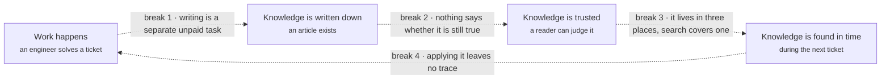
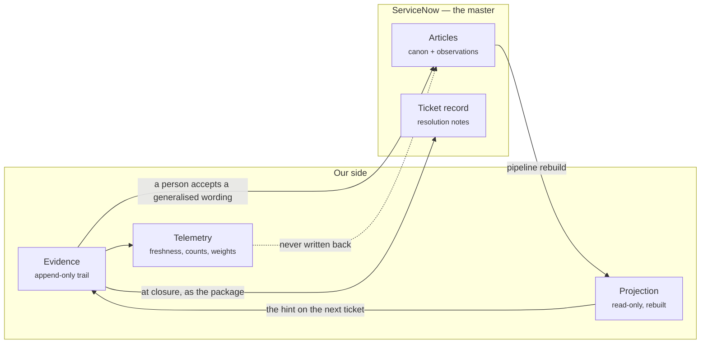
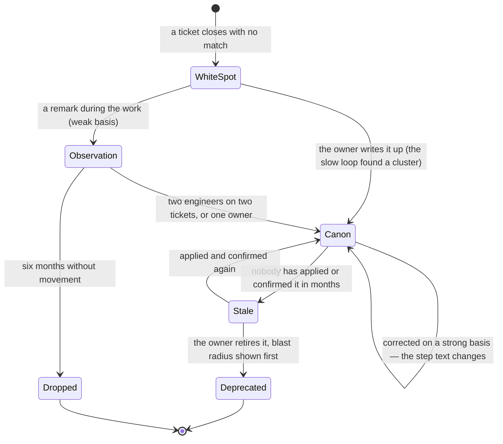
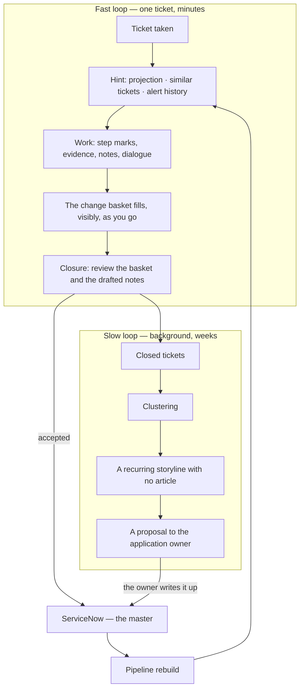
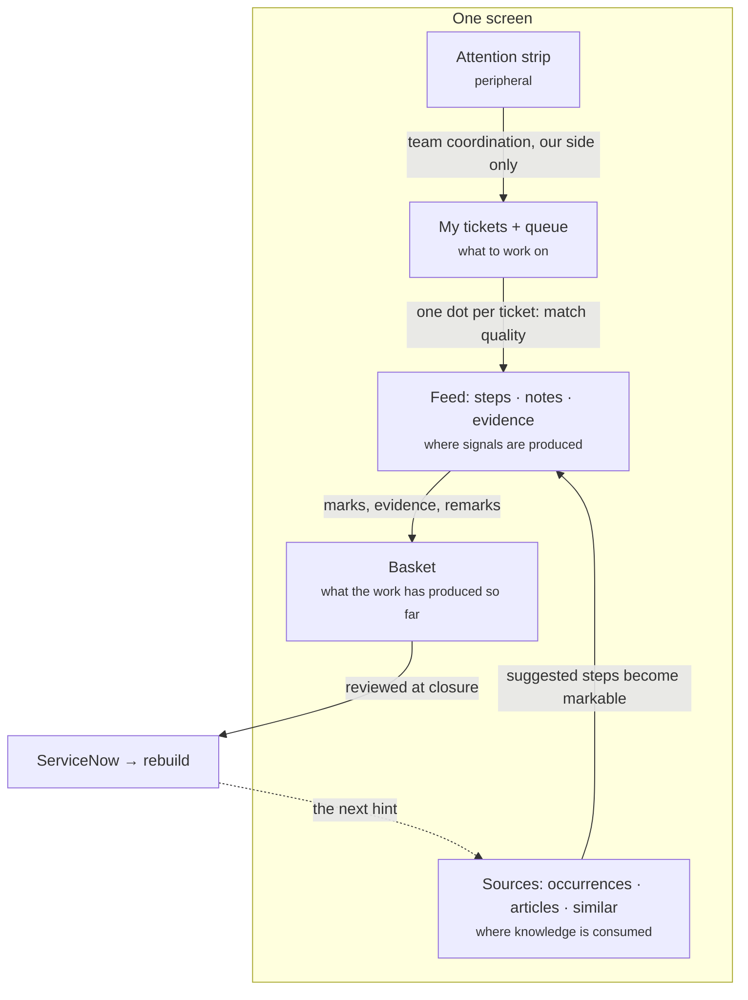

# The knowledge feedback loop in application support

**The whole idea in one document.** What we are building, why the usual approach fails, how a unit
of knowledge is born, confirmed, corrected and retired, and why the interface is shaped exactly this
way. Read this one document and the picture is complete.

Detail lives elsewhere and is not repeated here: rules that must not be broken in `invariants.md`,
closed arguments in `decisions.md`, unknowns in `open-questions.md`, entities and fields in
`domain.md`, screen-by-screen specifications in `screens/`, the ServiceNow contract in
`servicenow.md`, model call sites in `agent.md`, sequence and risks in `roadmap.md`.

---

## 1. Summary

Support engineers already produce the knowledge their team needs. Today it evaporates — into chat
messages, into Microsoft Planner card notes, into memory. The knowledge base fills with articles
nobody can judge, so experienced people stop reading it, so it receives even less, and the loop
never closes.

We are not building a better knowledge base. We are building **the screen an engineer works on**,
shaped so that the work itself closes the loop — one press at a time, without asking anyone to
write an article.

### What changes

| The classical approach | Ours |
|---|---|
| Knowledge is written **after** the work, as a separate task | Knowledge is captured **during** the work, as a by-product of it |
| The contribution is prose a person composes | The contribution is a mark their hand already makes |
| Freshness is a review date, or a hidden score | Freshness is a checkable fact: "confirmed 3 days ago, applied 14 times" |
| Quality is defended by a reviewer and a queue | Quality is defended by accumulated confirmations; changes are additive by default |
| An article is either right or wrong | An article has a canon and an observations margin; the margin is promoted by evidence |
| The system asks a person for what it could know itself | The system drafts; the person confirms or corrects |
| Motivate people to write better | **Relieve people of writing** |

The last row is the design. Everything else follows from it.

### What we actually ask of an engineer

Per ticket, in total: **a few presses.** Mark a step done, or did-not-help. Accept, edit or reject a
ready proposal at closure. Optionally type into a note field that is faster than the scratchpad they
use today. Nothing is mandatory, nothing is blocked if none of it happens, and nothing waits for a
model to answer.

### Why this can work when the classical version does not

- **The signal is nearly free.** A press costs no attention, so it happens on every ticket rather
  than on the few where someone felt dutiful.
- **The signal is structural, not self-reported.** "Step 3 did not help" is a fact of the work, not
  an opinion about the work — harder to fake and easier to trust.
- **The engineer is paid first.** A screen that is genuinely better to work on, and a resolution
  draft they did not have to write. Knowledge updating rides on top.

### The one-sentence version

Support engineers already produce the knowledge; the proposal is a screen shaped so the work itself
catches it, one press at a time, without asking anyone to write an article.

---

## 2. Why the classical loop stays open

A knowledge base is a control loop with four links. In a normal support organisation every one of
them is broken, and the failures compound.



| Break | The usual fix | Why the fix fails |
|---|---|---|
| **1. The write-up is a separate task, after the fact** | Mandate resolution notes, add required fields and templates | Blocking produces text written to pass a control. The completeness metric rises while quality falls — the worst outcome, because the failure is invisible in the numbers |
| **2. A reader cannot judge an article** | Review dates, confidence scores, ownership badges | A review date says an owner looked, not that reality still matches. A hidden number stops being believed the first time it is wrong, and after that it is decoration |
| **3. Knowledge sits in three places with different authority** — articles, closed tickets, people's heads | Merge everything into one ranked search index | Mixing authorities destroys trust in all three at once: a reader can no longer tell a curated procedure from one person's anecdote, so they discount both |
| **4. Applying knowledge produces no signal back** | "Was this helpful?", thumbs, star ratings, surveys | An extra ask with no payoff for the person answering. Response rates collapse within weeks, and what survives is polite noise that makes the base look healthier than it is |

And one trap that looks like a fix: **gamification.** Contribution counters, author leaderboards and
badges reliably produce contributions — and within a month a confirmation means "somebody wanted the
number to go up" rather than "this is still true". A metric that people optimise stops measuring. We
build none of it (§10).

Our answer to each break, in order:

1. Nobody writes after the fact. The system drafts from the trail of the work; the person reviews.
2. Freshness is stated as checkable facts, never as a score (I7).
3. The three sources stay three separate labelled lists, never one ranked list.
4. The signal is taken from gestures that already happen, so nothing extra is asked (§5).

---

## 3. Four kinds of matter, and the walls between them

Most confusion about "where does this go" disappears once these four are kept apart. They carry
different authority, live in different places, and moving something across a wall is always a
deliberate human act.

| | What it is | Where it lives | Who may change it | Example |
|---|---|---|---|---|
| **Knowledge** | Reusable statements that outlive the ticket | ServiceNow `kb_knowledge` — the master | An owner directly, or an engineer through an accepted proposal | "On latency alerts for the FIX gateway, check MQ depth upstream first" |
| **Projection** | The rebuilt, readable, linked form of knowledge that our interface shows | Our side, read-only, rebuilt by the pipeline | Nobody by hand. It is a function, not a store | The same procedure rendered with freshness, neighbours and history |
| **Evidence** | What happened on one ticket: command output, pasted logs, dashboard links, raw notes | The work trail, on our side, attached to the ticket | Append-only; never edited | `gw-router restart; latency 812 ms → 806 ms`, with a customer hostname in it |
| **Telemetry** | Facts about how knowledge behaves: applications, confirmations, deviations, not-applicable marks | Our side only | The system, from signals | "Applied 14 times, confirmed 3 days ago, 2 deviations on step 3" |

Two walls carry the whole design.

**Wall 1 — the projection is a function of the master.**

```text
projection = f(kb_knowledge in ServiceNow)
```

Nothing reaches the projection except by being written into ServiceNow first and rebuilt afterwards
(I1). The moment a shortcut is allowed "just for observations", half the living knowledge sits in a
system that is not the source of truth, and within a year the divergence is beyond repair.

**Wall 2 — evidence never becomes knowledge automatically.** Only a generalised wording that a
person read and accepted crosses (I4). Otherwise customer names, internal hostnames and production
log contents travel into a shared knowledge base — a data classification incident, not a defect.



Telemetry stays ours because ServiceNow cannot be customised and has nowhere to keep it; content
stays there because otherwise wall 1 falls (I6). The accepted cost: someone reading the article in
the native ServiceNow interface sees no freshness signals.

---

## 4. The knowledge cycle

This is the centre of the project. A unit of knowledge is not a document that either exists or does
not; it is a thing with a life, and every transition in that life is paid for by a signal produced
during ordinary work.

### 4.1 The life of one unit of knowledge



| Transition | What causes it | Who decides | Where it is recorded |
|---|---|---|---|
| nothing → white spot | A ticket closed with no article matched | The system, by absence | Owner dashboard; input to the slow loop |
| white spot → observation | A remark in the dialogue during the work | The engineer, at closure | The article's observations section in ServiceNow |
| white spot → canon | The slow loop finds a recurring storyline with evidence | The application owner | A new article in ServiceNow |
| observation → canon | Two engineers on two different tickets, or one owner (D7) | Accumulated confirmations | The canonical text of the article |
| observation → dropped | Six months without movement | Listed for the owner, never deleted silently | Owner dashboard |
| canon → canon, refreshed | Steps marked done; the resolution matched the prediction | The engineer's marks | Telemetry: `lastConfirmedAt`, `useCount` |
| canon → canon, corrected | A "did not help" mark **plus** attached evidence | The engineer accepts the proposal at closure | A new article version, with authorship |
| canon → stale | Time passing without application or confirmation | The system | Shown in words on the article card |
| stale → deprecated | The owner retires it | The application owner | ServiceNow; neighbours are shown before the act |

**The threshold is set for the real volume.** Fifteen engineers, roughly five tickets a day each. A
frequent procedure would clear any threshold; a rare one is applied twice a year. A quorum of three
would mean rare procedures never reach the canon — hence two engineers, or one owner, who is an
authority and needs no quorum (D7).

**Publication happens without review** (D2). In a round-the-clock team a review queue means a day of
delay, and a loop with a day of delay is a loop nobody feeds. What replaces the reviewer: changes
are additive by default, every version carries authorship and reverts in one click, and the
confirmation threshold above does the reviewer's work — later, but on evidence rather than opinion.

### 4.2 The two loops

The fast loop runs inside one ticket, on the shift. The slow loop runs in the background over the
mass of closed tickets. They produce different things and are addressed to different people.



**Why the fast loop is where the value is.** The engineer is the only person who knows, at that
moment, that step 3 does not work any more. An hour later they are on another ticket; a week later
nobody knows. Everything in the interface exists to catch that fact while the trail is hot (D3).

**Why the slow loop cannot be skipped.** No individual ticket reveals that eleven tickets shared a
storyline nobody wrote up. Generalisation over volume is a background job, and its output goes to
the **owner**, not the engineer: nobody writes a new article during a shift (D14).

### 4.3 Different knowledge ages differently

Deriving freshness from ticket closures is right for procedures and wrong for reference material.

| Article type | Contains | How freshness is confirmed | At closure |
|---|---|---|---|
| `reference` | Architecture, environments, owners, regulations | **Not by tickets.** By CI changes and owner attestation | Does not participate |
| `procedure_fault` | Diagnosis and repair of a failure | Application on an incident | Review of deviations |
| `procedure_fulfilment` | Handling a request | Application on a universal request | Short confirmation of the match |
| `procedure_interaction` | Working with a user, clarifications, routing | Application | Recording of conditions and branch points |

Reference articles age from the drift of reality, not from use. Showing them a ticket-derived
confirmation count would be a false signal, so we do not (`domain.md`, `ArticleType`).

For interaction procedures the valuable knowledge is usually not a sequence of steps but **the
clarifying question that had to be asked** — so applicability and branch points matter more than
steps.

### 4.4 The shape of a procedure

Enough structure for a change to address a specific block, and no more:

- **Applicability** — the signs under which this procedure fits
- **Steps** — an ordered sequence
- **Branch points** — a condition and the alternatives
- **Verification** — how to be sure it helped
- **Observations** — unconfirmed additions coming from tickets

A stricter typed format would kill authorship and produce forms nobody fills honestly. The
implementation is ordinary text with recognisable sections, formalised exactly enough to be
addressable by an anchor (§9).

---

## 5. Signals: what the work says without anyone writing

This is the mechanism the loop runs on. Every gesture below already happens, or costs one press.
Each carries a meaning, and each has exactly one destination.

| Gesture | Cost | What it means | Produces | Strength | Where it goes |
|---|---|---|---|---|---|
| A step marked **done** | one press | This step is real and it worked | `confirmation` | — | Telemetry: `useCount`, `lastConfirmedAt` |
| **All** steps done, no failures, on a recurring alert with a stable history | nothing extra | The procedure is true today | `confirmation` | strong | Telemetry; unlocks one-press closing (D17) |
| A step marked **did not help** | one press | The canonical text is wrong here | `correction` | weak on its own | The observations section |
| The same, with evidence pasted beside it | a paste | The same, now checkable | `correction` | **strong** | The canonical text changes |
| **Not applicable** on a suggested article | one press | The matching is wrong; the content is fine | `not_applicable` | — | Matching telemetry only. **Never touches the article** |
| An article suggested, opened, then not used | free | Weak relevance | a ranking signal | — | Telemetry |
| A remark in the dialogue during the work | voluntary typing | Something new was observed | `observation` | weak | Observations, awaiting promotion |
| A recurring alert resolved as the previous N were | nothing | A stable storyline | `confirmation` over N cases | strong when N ≥ 3 | The canonical text |
| A ticket closed with **no** match at all | nothing | The knowledge does not exist yet | a white spot | — | Owner dashboard, slow loop |
| A bucket or a tag on the attention strip | one press | An attention state, not knowledge | — | — | Our side only, never ServiceNow |

The rule behind the strength column, stated once: **a proposal changes canonical text only when it
rests on a structural fact plus evidence.** Anything weaker is published as an observation and waits
for a second, independent case (`domain.md`, "the rule of basis strength").

### What we deliberately never ask

"Was this helpful?" · star ratings · post-resolution surveys · mandatory notes · contribution
counters · author leaderboards. Each adds a request for attention whose only product is a
self-report, and a self-report is the weakest signal available.

### Why non-verbal signals beat asking

- **Sampling rate.** A signal that costs nothing arrives on every ticket. A signal that costs a
  minute arrives on the tickets where somebody felt dutiful — a biased sample of the easy ones.
- **Harder to fake.** "Step 3 did not help" is a fact of the resolution. "This article was helpful"
  is an opinion produced under mild social pressure.
- **It survives the model being down.** Step marks, alert history, CI changes and state changes are
  **structural** signals: they need no model at all, and the proposal still lands in the basket when
  the model is unavailable (`agent.md`). Prose is an addition, never the foundation.

That last point is also why the resolution draft is built on marks rather than notes: notes are
barely written today, so a design that depends on them depends on something that does not exist.

---

## 6. How an engineer works, and where knowledge moves

One screen the engineer does not leave. Switching tickets changes the content, not the screen. The
board, the search and the knowledge come to them.

```mermaid
sequenceDiagram
    actor E as Engineer
    participant S as The screen
    participant Ag as Agent
    participant B as Change basket
    participant SN as ServiceNow

    E->>S: takes a ticket from the queue (one press)
    S-->>E: hint — past occurrences · articles · similar tickets
    Note over S,Ag: the hint is asynchronous; the ticket is workable without it

    E->>S: marks step 1 done
    S->>B: confirmation
    E->>S: marks step 3 "did not help"
    S->>B: correction (weak)
    E->>S: pastes the command output
    S->>B: the correction becomes strong
    Ag-->>E: one short remark about the deviation
    E->>S: types a note (on screen in 100 ms)
    Ag-->>S: the polished version is drawn in later

    E->>S: go to closure
    S-->>E: drafted slots, each labelled with its source
    S-->>E: the basket, each proposal with its basis
    E->>S: accepts, edits, rejects — then closes
    S->>SN: the ticket record is written first
    S-)SN: accepted proposals are published afterwards, asynchronously
```

### 6.1 During the work

**The feed is one chronological place.** Notes, step marks, evidence and agent remarks interleave.
There is no second place for details — the card and the ticket are one object (I5). That gap is
precisely why details end up in Planner card notes today, outside ServiceNow entirely.

**One field, two modes.** Enter files a note and the agent stays silent; ⌘Enter asks a question. The
agent is silent by default and speaks only where it noticed a deviation. An agent that comments on
every note gets the feed abandoned within a week.

**Raw and polished text are both kept** (D8). The polished one is shown, the raw one is one click
away. Without this a person does not recognise their own words and stops trusting the system — and
in an argument about wording, the original is the evidence.

**The basket is visible the whole time.** Whatever will be asked at closure is already on screen, so
closure holds no surprises.

**The dialogue happens now, not at closure** (D3). "These steps do not fit", "look towards MQ",
"this article is not about our case" — said while the trail is hot, they are worth more than the
same sentences reconstructed twenty minutes later.

**Sources stay three labelled sections** — past occurrences of this alert, articles, similar tickets
— because they carry different authority. Merging them into one ranked list is the fastest way to
destroy trust in all three.

### 6.2 Origin changes what is useful

Origin is a first-class attribute, not a category label.

- **From a monitoring alert.** The most useful knowledge is usually not an article but a history:
  this alert fired fourteen times, twelve ended the same way, two were real problems. A
  machine-readable payload matches repeats precisely, so past occurrences come first.
- **From a user.** The signs are blurred. The valuable knowledge is which clarifying question to ask
  and where to route it. There may be no steps at all.

The pilot starts with recurring alerts (D13): deterministic, frequent, matchable by signature — the
fastest route to coverage.

### 6.3 At closure

Closure is **a review of what accumulated**, never a writing task.

The screen is split spatially on purpose: on the left what belongs to this incident only, on the
right what somebody else will reuse. People confuse the two constantly, and two labelled columns
teach the difference without a training session.

- **Every drafted slot names its source** — "from the alert and the step marks", "from CHG0031204
  and the pasted output". A person who sees where text came from checks it; a person who sees only a
  result signs blindly (I7).
- **An empty slot stays empty**, highlighted, holding a pinpoint question — "what confirmed that the
  latency returned to normal?" Invented text is worse than a visible gap.
- **The close button is never disabled** (I3). A gap is recorded and counted, not prevented.
- **Every proposal shows its final text and its basis before acceptance** (I4), and an observation
  says how many confirmations remain before it reaches the canon.
- **The ticket is closed and written first; publication follows asynchronously** (D18). Publishing
  touches a shared article and may hit a conflict with an owner editing the same text — a closure
  must never wait on somebody else's edit. A conflict is never resolved by overwriting: the proposal
  is rebuilt against the new body and shown again.

The screen after closure states what actually went where — the notes by slot, the changes published,
their publication state. It is needed for the first weeks, until people believe the system writes
sensible things; afterwards it collapses to a single line.

### 6.4 The attention budget

How much the system may ask depends on the **novelty of the ticket**, never on the seniority of the
engineer. A junior on a familiar ticket should not have to write anything either.

| Situation | What happens |
|---|---|
| Strong match, the resolution matched the prediction | A ready package, one confirmation |
| Strong match, the resolution diverged | Exactly one pinpoint question |
| Weak match, or none | A full review — there is no short path, deliberately |
| The article has not been confirmed in a long time | An explicit request for confirmation |
| A recurring alert with a stable history | An offer to close it as last time (D17) |

---

## 7. The cybernetics of the interface

The screen is not a form over a database. It is the controller of the loop in §4: it senses what the
work produces, decides how much to interrupt, and emits changes back into the master. Every layout
rule below is a property of that control system, not a matter of taste.

### 7.1 Zones as loops



| Zone | What it senses | What it emits | Which loop it serves |
|---|---|---|---|
| Attention strip | What a human marked by hand | Nothing into knowledge | Team coordination — it replaces the Planner board |
| Ticket list | Ticket state, match quality per row | The choice of what to work on | Planning the shift |
| Feed | Marks, evidence, notes, questions | Confirmations, corrections, observations | **The fast knowledge loop** |
| Sources | The projection, closed tickets, alert history | Applications, not-applicable marks | Consumption, and matching telemetry |
| Basket | Everything the two above produced | The reviewed set at closure | The write-back |

**The dot on a ticket row is a sensor read backwards.** Before anything is opened, its colour says
whether a confirmed procedure exists, whether the match is weak, whether nobody has applied it in
months, or whether there is nothing at all — which is where new knowledge comes from. A shift can be
planned from the list alone.

### 7.2 Control properties, and what breaks without each

**Sampling rate — the interface never waits for the model (I2).** A note is on screen in 100 ms
whether the model answers in a second, in thirty, or never. This is not a performance nicety: a few
seconds of latency ends the habit of writing notes, and the loop is left without fuel. Every model
result is optional decoration drawn on top of state that is already there.

**Error-driven interruption — interrupt in proportion to surprise.** If the resolution matched the
prediction, there is nothing to ask about. Questions are aimed by novelty plus a low-frequency
random check; a question asked at every closure is automated away inside a person's head within a
week.

**Bandwidth of the periphery — preattentive only.** Numbers, dots, position, slight movement. The
moment there is text at the edge that must be read to understand the state, focus is gone. Nothing
pops over the work: no modal dialogs, no toasts, no sound. A change is noticed through movement, not
through a new block that shifts the layout.

**Damping — changes are additive by default.** An unconfirmed generalisation never overwrites
verified text. Without this the canon oscillates with every strong opinion and stops being canon.

**Anti-windup — the loop that measures the loop.** If confirmation degenerates into a reflex click,
freshness becomes a false signal, which is worse than no signal because it is believed. Four
mechanisms, all quiet, none punitive:

- The one-press path exists **only** on a strong prediction (D17). With a weak match there is
  nothing to offer, so there is nothing to click through.
- The weight of a person's confirmations drops if they are regularly refuted by later tickets, or if
  the interval before confirming is consistently below plausible reading time. Without notification,
  and without appearing anywhere in the interface.
- Pinpoint questions are selective, not routine.
- No counters and no ratings. The only figure it is acceptable to show a person is how many times
  their article helped somebody else.

**Observability — show the basis, not a score (I7).** Every suggestion says why it matched and when
it was last confirmed. Every drafted field says where its text came from. Every proposal carries the
basis it was derived from. A hidden confidence number is unfalsifiable, and unfalsifiable numbers
stop being believed.

**Never block the actuator (I3).** No mandatory fields, no validation, no dialogue that reads as a
reproach. A blocked closure produces text written to satisfy a control.

### 7.3 The four rules that are not negotiable

| Rule | Why |
|---|---|
| It never waits for the model | The note is on screen in 100 ms regardless; otherwise the signal source dies (I2) |
| It never blocks a closure | Blocking raises the completeness metric while lowering quality — invisibly (I3) |
| It never interrupts | Peripheral information stays preattentive; nothing pops over the work |
| It always shows the basis | A visible basis gets checked; a bare result gets signed blindly (I7) |

---

## 8. Where knowledge does **not** update

Knowing where the loop deliberately does not reach matters as much as knowing where it does.

- **Reference articles are not confirmed by tickets.** They age from the drift of reality; their
  signals are CI changes and owner attestation (§4.3).
- **Evidence never crosses on its own.** Only an accepted, generalised wording reaches an article
  (I4); the raw output stays on the ticket. Where the data itself matters we keep **a link to a
  monitoring dashboard with a time window** rather than a copy — almost as useful, and it removes
  the data classification question.
- **Telemetry never travels to ServiceNow** (I6). There is nowhere to put it, and it is not content.
- **A "not applicable" mark never touches article text.** It corrects the *matching*, not the
  knowledge. It accumulates separately and improves the hint.
- **Buckets and tags are not knowledge.** They are coordination state, they live on our side, and
  they are invisible in the native ServiceNow interface — acceptable, because today's board is
  already outside ServiceNow.
- **The agent never publishes anything itself.** Every change reaches the master through a human
  acceptance on the closure screen.

---

## 9. What links things together

**Anchors are what make the loop closable.** A projection block carries the article's `sys_id`, the
heading path, and a hash of the fragment as it was at projection time. On publication the hash is
checked against the current body: if it still matches, a new version is written; if it does not, the
article changed underneath us, and the proposal is rebuilt against the new text and shown again.
Last write must never win — that silently erases an owner's work. The mechanics are in
`servicenow.md`; whether the pipeline can emit provenance at all is Q7, and it is the single largest
technical dependency of the project.

A block the pipeline synthesised has no anchor and cannot be edited in place. That limitation is
shown honestly rather than masked; changes near it are appended to the end of the article.

**Edges between articles are derived, not drawn by hand:** a shared CI, explicit links, CMDB
relations, and co-occurrence on the same ticket. The last one is earned by the loop — the longer the
system runs, the better the graph, with nobody maintaining it.

**The graph opens on demand and always egocentrically** — one node, radius one to two, never in
full. It answers exactly three questions: what breaks if this article is deprecated (blast radius),
how to orient in an unfamiliar area, and where the structural pathologies are — a hub article that
is a single point of knowledge failure, isolated clusters, orphans left behind when a CI is retired.

**The application owner's view is a two-by-two** per application, confirmation recency against
frequency of use: on fire (review), healthy (leave alone), dead weight (archive or merge), rare but
alive (check once a year). Only the red quadrant is shown on entry — dead weight is the largest
group and the least urgent, and showing it first would drown the owner. Alongside it: tickets closed
with no match (white spots — not a quality problem but a missing-article problem), observations
awaiting a second confirmation, observations older than six months, and reference articles not
attested in over a year.

---

## 10. Scope, success, and what we refuse to build

**The pilot.** One global team, round the clock with rotating regions; about fifteen engineers per
region, roughly five tickets a day each. One knowledge base. Incidents and universal requests;
service requests are out of scope. Starting with recurring monitoring alerts (D13).

**ServiceNow stays the master and needs no customisation.** No new fields, no business rules, no
workflow changes. Everything goes through the API, and the adapter is the only module that knows it
exists.

**What counts as success**

| Measure | Note |
|---|---|
| Resolution note quality — meaningful slots filled, not volume of text | Measurable from day one: the write-back has a fixed structure |
| Knowledge update rate — the share of closures that produced a confirmation or a change | The loop either runs or it does not |
| Time to close — must not get worse | A guardrail, not a target |
| Stale article detection | The thing that makes the base trustworthy again |

**What wins the engineer over**, in order: a screen that is genuinely good for working on their own
tickets; a hint with trust signals they can check; a resolution draft they did not write. Knowledge
updating rides on top as a by-product.

**What we do not build**

- Feature parity with ServiceNow. Correspondence, approvals, attachments and escalations stay in the
  native interface, one contextual link away (D12)
- Contribution counters, author ratings, leaderboards — §2
- Hidden confidence numbers. Freshness in words, checkable
- Modal dialogs and toasts over the work
- Invented content for an empty slot. A gap is better than invented text
- A graph showcase. The graph answers three questions or it does not open

---

## 11. Where to go next

| You want | Read |
|---|---|
| The rules that must never be broken, and how each breaks unnoticed | `invariants.md` |
| Why a decision is what it is, and what was rejected | `decisions.md` |
| What is still unknown and what it blocks | `open-questions.md` |
| Entities, fields, state transitions | `domain.md` |
| Screen layouts and acceptance criteria | `screens/` |
| Tables, the write-back contract, fixtures | `servicenow.md` |
| Where the model is called, and what happens when it is down | `agent.md` |
| The order of building, and the risks | `roadmap.md` |
