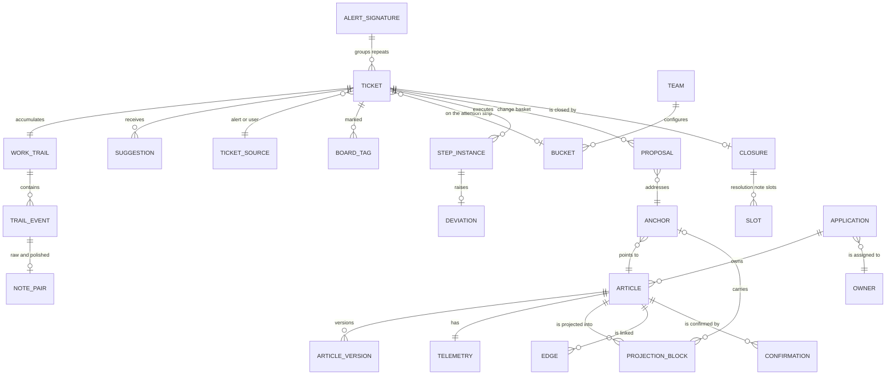

# Domain model

The entities of the application, their fields and state transitions. This is the contract between the screens and the store. Fields marked `?` are optional.

Source notation: **SN** — comes from ServiceNow, **ours** — exists only on our side, **derived** — computed.

---

## The whole map



The typing of `TRAIL_EVENT` is deliberately general rather than tailored to closure: the same
journal has to be able to yield a shift handover brief later. `ALERT_SIGNATURE` is what makes the
occurrence history and the short path possible at all (D17). `BUCKET` and `BOARD_TAG` live only on
our side and are a property of the team (D6).

---

## Ticket

A mirror of an incident or a universal request. It has no content of its own beyond our telemetry and marks.

| Field | Type | Source | Note |
|---|---|---|---|
| `id` | string | SN | `INC…`, `REQ…` |
| `sysId` | string | SN | key for writing |
| `type` | `incident` \| `universal_request` | SN | |
| `title` | string | SN | short_description |
| `description` | string | SN | contains the existing enrichment |
| `application` | string | SN | via CI |
| `ciId` | string? | SN | |
| `priority` | string | SN | |
| `origin` | `alert` \| `user` | derived | by creation source |
| `alertSignature` | string? | SN/derived | grouping key for repeats |
| `assignee` | string? | SN | |
| `state` | TicketState | SN + ours | see below |
| `openedAt` | datetime | SN | |
| `bucket` | BucketId? | ours | attention strip |
| `tags` | TagId[] | ours | |
| `knowledgeMatch` | `strong` \| `weak` \| `stale` \| `none` | derived | for the list row |

### TicketState

```
queue ──take──► work ──┬──waiting──► wait ──resume──► work
                       │
                       └──close──► closing ──write──► closed
```

- `queue` — unassigned, available to take
- `work` — assigned to me, active work
- `wait` — assigned to me, the ball is not on our side
- `closing` — the closure screen is open, the ticket is not yet closed
- `closed` — the package has been written to ServiceNow

`closing` is an interface state; it is not reflected in ServiceNow. Leaving it is possible in both directions.

---

## WorkTrail and TrailEvent

An append-only journal. Nothing is edited or deleted. The basis for the resolution notes draft, the future shift handover brief and the audit.

| TrailEvent field | Type | Note |
|---|---|---|
| `id` | string | |
| `ticketId` | string | |
| `at` | datetime | |
| `actor` | `user` \| `agent` \| `system` | |
| `kind` | TrailEventKind | see below |
| `payload` | object | depends on kind |

### TrailEventKind

`state_changed`, `assigned`, `article_suggested`, `article_opened`, `step_marked`, `evidence_added`, `note`, `question`, `agent_reply`, `proposal_raised`, `proposal_decided`, `bucket_changed`, `tag_changed`, `pushed_to_sn`

---

## NotePair

Attached to a `note` event.

| Field | Type | Note |
|---|---|---|
| `raw` | string | as the person wrote it, appears instantly |
| `polished` | string? | the model's result, `null` until ready |
| `polishState` | `pending` \| `ready` \| `failed` | on `failed` the `raw` text is shown |

Both texts are always stored. `polished` is displayed, switching to `raw` takes one click.

---

## Suggestion

The result of the hint produced when a ticket is opened. Three separate corpora; they are not mixed in the output.

| Field | Type | Note |
|---|---|---|
| `ticketId` | string | |
| `articles` | ArticleHit[] | from the projection |
| `similarTickets` | TicketHit[] | from closed tickets |
| `alertHistory` | AlertHistory? | only for `origin: alert` |

**ArticleHit**: `articleId`, `title`, `matchReason` (as text), `lastConfirmedAt?`, `useCount`, `freshness` (`fresh` \| `stale` \| `unknown`).

**AlertHistory**: `signature`, `occurrences`, `commonCount`, `commonResolution` (as text), `exceptions`.

`commonCount` is how many of `occurrences` ended with the same resolution. It is what makes the history "stable" and gates the short path (D17); without a number there is nothing to decide on.

---

## StepInstance

An instance of a procedure step on a specific ticket.

| Field | Type |
|---|---|
| `ticketId` | string |
| `stepRef` | AnchorRef |
| `text` | string |
| `state` | `open` \| `done` \| `failed` |

Cycles through: `open → done → failed → open`. The transition into `failed` raises a Proposal of kind `correction` with a strong basis.

---

## Proposal

A unit of the change basket. Accumulated during the work, reviewed at closure.

| Field | Type | Note |
|---|---|---|
| `id` | string | |
| `ticketId` | string | |
| `kind` | ProposalKind | see below |
| `anchor` | AnchorRef? | empty for `creation` |
| `targetLabel` | string | human-readable "where to" |
| `text` | string | the final text the article will receive |
| `diff` | `{ minus, plus }`? | for pinpoint edits |
| `basis` | string | what it was derived from, always shown |
| `strength` | `strong` \| `weak` | decides canon or observation |
| `promotionLeft` | number? | how many confirmations remain until promotion |
| `status` | `pending` \| `accepted` \| `rejected` | |

### ProposalKind

`confirmation`, `correction`, `extension`, `creation`, `deprecation`, `link`, `not_applicable`

`not_applicable` is a correction to the matching, not to the content. It is not written into the article; it only updates telemetry.

### The rule of basis strength

- `strong` — there is a step mark and attached evidence. Changes the canonical text.
- `weak` — only a remark in the dialogue. Goes into the observations section.

A weak proposal is promoted into the canon after two confirmations by different engineers on different tickets, or one confirmation by the application owner.

---

## Closure and Slot

| Closure field | Type |
|---|---|
| `ticketId` | string |
| `slots` | Slot[] |
| `proposals` | Proposal[] |
| `closedAt` | datetime? |

| Slot field | Type | Note |
|---|---|---|
| `id` | `symptom` \| `cause` \| `action` \| `verification` | fixed set |
| `label` | string | |
| `value` | string | may be empty |
| `provenance` | string | what it was derived from |
| `question` | string? | the agent's pinpoint question when empty |
| `isGap` | boolean | derived: `value` is empty |

Gaps do not block closing (I3), but they are recorded and counted in the team statistics.

---

## Anchor and projection

| AnchorRef field | Type | Note |
|---|---|---|
| `articleSysId` | string | the article in ServiceNow |
| `headingPath` | string[] | the path of headings inside the article |
| `contentHash` | string | hash of the fragment at projection time |

| ProjectionBlock field | Type | Note |
|---|---|---|
| `id` | string | |
| `pageId` | string | |
| `body` | string | |
| `anchor` | AnchorRef? | `null` — the block was synthesised by the pipeline |

A block without an anchor cannot be edited in place. Changes near it go as an append to the end of the article, and this is shown to the user (see `screens/knowledge-page.md`).

---

## Article and Telemetry

Article is a mirror of `kb_knowledge`; the content is not stored on our side as the source of truth.

| Article field | Type | Source |
|---|---|---|
| `sysId` | string | SN |
| `title` | string | SN |
| `type` | ArticleType | derived or SN |
| `applicationId` | string? | derived via CI |
| `version` | string | SN |

### ArticleType

The type determines how freshness is confirmed and how the closure screen behaves.

| Type | Freshness confirmed by | At closure |
|---|---|---|
| `reference` | Not by tickets. By CI changes and owner attestation | Does not participate |
| `procedure_fault` | Application on an incident | Review of deviations |
| `procedure_fulfilment` | Application on a universal request | Short confirmation of the match |
| `procedure_interaction` | Application | Recording of conditions and branch points |

Reference articles age from the drift of reality, not from use. Showing a ticket-derived confirmation metric for them is not allowed — it would be false.

For `procedure_interaction`, applicability and branch points matter more than steps: the most valuable knowledge there is the clarifying question that had to be asked.

| Telemetry field | Type | Source |
|---|---|---|
| `articleId` | string | |
| `useCount` | number | ours |
| `confirmations` | Confirmation[] | ours |
| `lastConfirmedAt` | datetime? | derived |
| `deviations` | number | ours |
| `notApplicableMarks` | number | ours |

**Confirmation**: `articleVersion`, `engineerId`, `ticketId`, `at`, `weight`.

`weight` is reduced for confirmations that are regularly refuted by subsequent tickets, or when the interval before confirmation is consistently below a plausible reading time. Quietly, without notifications.

---

## Edge

A link between articles. Edges are predominantly derived, not drawn by hand.

| Field | Type | Note |
|---|---|---|
| `from` | articleId | |
| `to` | articleId | |
| `kind` | EdgeKind | see below |
| `derivedFrom` | string | what supports the edge |
| `weight` | number | for `co_occurrence` — the number of joint appearances |

### EdgeKind

| Type | Where from |
|---|---|
| `shared_ci` | A shared configuration item |
| `explicit_link` | An explicit link in the article text |
| `cmdb_relation` | A relation from the CMDB |
| `co_occurrence` | Two articles used on the same ticket |

`co_occurrence` is earned by the feedback loop: the graph improves as work goes on, without separate effort to populate it. It is the only kind of edge that cannot be obtained at launch — it accumulates.

The graph is never opened in full. Only egocentrically, radius one to two. Three justified tasks: the blast radius when deprecating an article, orientation in an unfamiliar area, structural pathologies (a hub article as a single point of knowledge failure, isolated clusters, orphans when a CI is retired).

---

## Bucket and Tag

| Bucket field | Type | Note |
|---|---|---|
| `id` | string | |
| `teamId` | string | the set of buckets is a property of the team |
| `label` | string | |
| `emphasis` | `swarm` \| `attention` \| `handover` \| `plain` | affects presentation |
| `order` | number | |

Defaults: swarm in progress, needs attention, for the next shift.

Tags: `wait-user`, `wait-team`, `recurring`, `next-shift`. This set is configurable by the team as well.

Both entities live only on our side and are not reflected in ServiceNow.

---

## KnowledgePage — the projection of an article

The projection is assembled by the pipeline from `kb_knowledge` (I1). On our side it is only read: there is no write path other than the output of a rebuild. An edit goes through a proposal via an anchor, not through a write into the projection.

| Field | Type | Source |
|---|---|---|
| `id` | string | equal to `articleSysId`; we do not introduce a separate identifier |
| `articleSysId` | string | SN |
| `title` | string | SN |
| `type` | ArticleType | determines the confirmation loop |
| `application` | string | derived via CI |
| `version` | string | SN, the body version at projection time |
| `blocks` | ProjectionBlock[] | pipeline |
| `observations` | Observation[] | stored in the article body in SN, in a marked-up section |
| `neighbors` | Neighbor[] | edges, derived |
| `history` | PageHistoryEntry[] | article versions with the source ticket |
| `rebuiltAt` | datetime | when the pipeline last rebuilt it |
| `telemetry` | PageTelemetry | ours (I6) |

`rebuiltAt` is shown on the screen: the rebuild is asynchronous, and the interface says so honestly.

### ProjectionBlock

To the fields above is added `section` — the procedure section recognised by the pipeline:
`applicability` \| `steps` \| `branching` \| `verification` \| `free`.
For `reference`, all blocks are `free`.

A block with `anchor: null` was synthesised by the pipeline, has no counterpart in the article and cannot be edited in place. The limitation is shown in words, not hidden.

### Observation

An unconfirmed addition coming from a ticket. Lives separately from the canonical text.

| Field | Type | Note |
|---|---|---|
| `id` | string | |
| `pageId` | string | |
| `text` | string | a generalised wording, not evidence (I4) |
| `basis` | string | always non-empty (I7) |
| `confirmations` | number | accumulated |
| `promotionThreshold` | number | two engineers or the owner (D7) |
| `raisedAt` | datetime | older than six months without movement — into the owner's list |
| `sourceTicketIds` | string[] | where it came from |

### PageHistoryEntry

| Field | Type | Note |
|---|---|---|
| `id` | string | |
| `at` | datetime | |
| `author` | string | |
| `sourceTicketId` | string? | the ticket on which the edit was born |
| `summary` | string | what changed |
| `revertable` | boolean | one-click revert is the compensation for publishing without review (D2) |

### Neighbor

An expanded edge for display as a list. The fields of `Edge` plus the neighbour's `title`. The graph is not opened in full.

### PageTelemetry

`useCount`, `lastConfirmedAt?`, `deviations`, `notApplicableMarks` — for procedures.
`lastAttestedAt?`, `ciChangesSinceAttestation?` — for `reference` only: reference articles age from the drift of reality, and a ticket-derived confirmation counter for them is false.

---

## Person

People from `sys_user`. Needed so that the general queue shows who holds a ticket.

| Field | Type | Source |
|---|---|---|
| `id` | string | SN |
| `name` | string | SN |
| `region` | string | SN, for the round-the-clock rotation of regions |

We do not write. We do not introduce contribution counters or ratings for people.

---

## Publication of an accepted proposal

The result of dispatching one accepted proposal after closing (D18). Lives on our side and is shown on the after-closure screen.

| PublicationOutcome field | Type | Note |
|---|---|---|
| `proposalId` | string | |
| `target` | `article` \| `telemetry` | which path the kind took |
| `state` | `sending` \| `published` \| `conflict` \| `failed` | |
| `version` | string? | the new article version on `published` |
| `detail` | string? | the reason on `conflict` and `failed`, human-readable |

`conflict` is not an error: the article was changed in ServiceNow while the work was going on. The proposal is preserved and rebuilt against the new body; the ticket stays closed.

---

## Telemetry writes

Telemetry lives only on our side (I6). It is written by three events, and nothing else changes it.

| TelemetryWrite kind | Raised by | Effect |
|---|---|---|
| `confirmation` | An accepted `confirmation` proposal | Adds a Confirmation, refreshes `lastConfirmedAt` |
| `not_applicable` | An accepted `not_applicable` proposal | Increments `notApplicableMarks` |
| `deviation` | An accepted `correction` proposal | Increments `deviations` |
| `use` | An `article_opened` trail event | Increments `useCount` |

`weight` on a Confirmation is computed on our side and is never shown in the interface (`agent.md`, "Protection against formal confirmation").

---

## Evidence in the trail

The payload of an `evidence_added` event.

| Field | Type | Note |
|---|---|---|
| `text` | string | the pasted fragment, as it was |
| `isLink` | boolean | derived: the fragment is a URL |
| `label` | string? | for a link — what it points at, in words |

Evidence stays on the ticket. It reaches an article only through a proposal, in generalised form, and the resulting text is visible before acceptance (I4).
