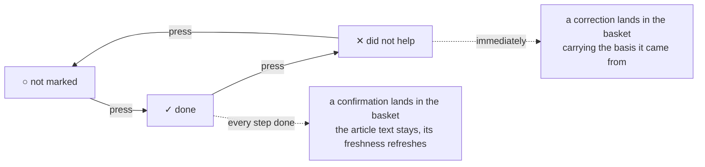
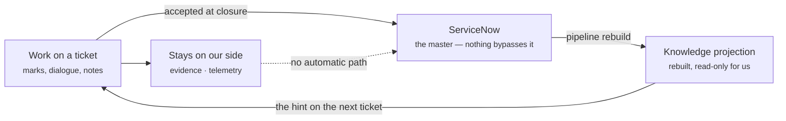

# The case in one page

A short version of `concept.md` for people who decide whether this gets built. It is about the
interface: what an engineer sees, what they touch, and why each part is the way it is. The full
reasoning is in the other documents; the references point to where.

Scale: about fifteen engineers per region, roughly five tickets a day each, round the clock with
rotating regions. Pilot: one team, one knowledge base.

---

## The screen

Today an engineer moves between a ServiceNow form of twenty fields where three matter, a Planner
board kept by hand, a knowledge base nobody trusts, and a chat window. The proposal is one screen
they do not leave: switching tickets changes the content, not the screen.

```
┌──────────────────────────────────────────────────────────────────────────────┐
│ Work   Queue   Knowledge                              Shift engineer · EMEA  │
├──────────────────────────────────────────────────────────────────────────────┤
│ ● Swarm 1   ● Needs attention 2   ● For the next shift 1            expand   │
├──────────────┬───────────────────────────────────────┬───────────────────────┤
│ IN MY WORK 2 │ INC0448213                            │ PAST OCCURRENCES      │
│ ●INC0448213  │ FIX gateway latency, EMEA             │ 12 of 14: MQ drained  │
│  FIX gateway │ alert, fired 14 times · 14 min        │ 2: a real problem     │
│ ●INC0448190  │ [recurring] [Swarm] [Waiting]         │                       │
│  T+1 report  ├───────────────────────────────────────┤ ARTICLES              │
│              │ SUGGESTED STEPS                       │ ┌───────────────────┐ │
│ WAITING 1    │  ✓ Check latency on GW-3              │ │ FIX gw: latency   │ │
│ ●REQ0032118  │  ✓ Compare with the CI change window  │ │ confirmed 3 d, 14×│ │
│              │  ✕ Restart gw-router      did not help│ │ matched by CI     │ │
│ ──────────── ├───────────────────────────────────────┤ └───────────────────┘ │
│ QUEUE 3      │ 09:38 note                            │ ┌───────────────────┐ │
│ ●INC0448240  │  Restart done, latency unchanged.     │ │ MQ: draining      │ │
│        [take]│ 09:39 agent                           │ │ not confirmed 9 mo│ │
│ ●INC0448244  │  Step 3 did not work. Record it as    │ └───────────────────┘ │
│        [take]│  a deviation? [Record] [Not now]      │                       │
│              ├───────────────────────────────────────┤ SIMILAR TICKETS       │
│              │ ┌───────────────────────────────────┐ │ INC0447901 — 22 min   │
│              │ │ A note, a log line, a link…       │ ├───────────────────────┤
│              │ │ Enter · ⌘Enter ask · ⇧Enter evid. │ │ BASKET 2              │
│              │ └───────────────────────────────────┘ │ Correction · step 3   │
│              │                                       │ Observation · depth   │
│              │                                       │ [ Go to closure ]     │
└──────────────┴───────────────────────────────────────┴───────────────────────┘
```

**One dot per ticket, before it is opened.** Teal — a confirmed procedure. Grey — a weak match.
Amber — nobody has applied it in months. Pink — no match at all, which is where new knowledge comes
from. A shift can be planned from the list alone.

**Divided by state, not priority.** "In work" and "waiting" are different modes of attention: one
needs action now, the other must not be forgotten.

**The strip at the top is peripheral vision.** Dots and counters, nothing to read. It replaces the
Planner board, which is the reason the team switches at all.

**The article card never shows a confidence score.** It shows when the article was last confirmed,
how often it has been applied, and why it matched — facts a person can check (I7).

**Three source sections, never merged into one ranked list.** Past occurrences of this alert,
articles, similar tickets. They carry different authority, and mixing them destroys trust in all
three.

Full layout and acceptance criteria: `main.md`, `workspace.md`.

---

## The interaction that carries everything

A step is a button. One press moves it round the cycle, and that press is the entire contribution we
ask for.



Nothing is written and nothing is asked. Pressing again withdraws the proposal that the mark raised.
The agent may add one short remark where it noticed the deviation — never on every note, or the feed
is abandoned within a week. If the model is unavailable, the mark still raises its proposal: it is a
structural signal, not a model one (`agent.md`).

This is the whole trick. We do not ask engineers to write better notes; we take the signal their
hands already produce.

---

## The end of the ticket

Closing is a review of what accumulated during the work, not a writing task.

```
┌──────────────────────────────────────────────────────────────────────────────┐
│ INC0448213   Closure                                          back to work   │
├───────────────────────────────────────┬──────────────────────────────────────┤
│ INTO THE TICKET — THIS CASE ONLY      │ INTO THE KNOWLEDGE BASE — FOR OTHERS │
│                                       │                                      │
│ Symptom     from the alert and marks  │ ┌──────────────────────────────────┐ │
│ [Latency on GW-3 grew to 800 ms    ]  │ │ Correction · FIX gateway, step 3 │ │
│                                       │ │ − Restart the gw-router service  │ │
│ Cause       12 of 14 past occurrences │ │ + Check the MQ depth on upstream │ │
│ [MQ queue overflow on upstream     ]  │ │ basis: a “did not help” mark and │ │
│                                       │ │        the pasted output         │ │
│ What was done   step marks, 2 done    │ │ [Accept] [Edit] [Reject]         │ │
│ [Restart had no effect; drained    ]  │ └──────────────────────────────────┘ │
│                                       │ ┌──────────────────────────────────┐ │
│ Verification                     gap  │ │ Observation · MQ queue depth     │ │
│ [What confirmed it returned to     ]  │ │ Depth above 40k precedes latency │ │
│ [normal?                           ]  │ │ basis: one case · canon after +1 │ │
│                                       │ │ [Accept] [Reject]                │ │
│ [Accept and close]  1 gap will remain │ └──────────────────────────────────┘ │
└───────────────────────────────────────┴──────────────────────────────────────┘
```

**The split is spatial on purpose.** On the left what belongs to this incident, on the right what
somebody else will reuse. People confuse the two constantly, and two labelled columns teach the
difference without training.

**Every field names its source.** A person who sees where the text came from checks it; a person who
sees only a result signs blindly.

**The close button is never disabled** (I3). A gap is recorded and counted, not prevented. A block
would produce text written to pass a control: the completeness metric would rise while quality fell,
which is the worst possible outcome because it is invisible.

**The final text of each proposal is visible before it is accepted** (I4), with its basis, and for an
observation, how many confirmations remain until it reaches the canonical text.

Full specification: `closure.md`.

---

## The rules the interface obeys

| Rule | Why it is not negotiable |
|---|---|
| **It never waits for the model** | A note is on screen in 100 ms whether the model answers in a second, in thirty, or never. A few seconds of waiting would end the habit of writing notes, and the loop would run out of fuel (I2) |
| **It never blocks a closure** | No mandatory fields, no validation, no dialogue that reads as a reproach (I3) |
| **It never interrupts** | No modal dialogs, no toasts, no sound. Peripheral information stays preattentive; the moment there is text to read at the edge, focus is gone |
| **It always shows the basis** | Every suggestion says why it matched and when it was confirmed; every drafted field says where its text came from (I7) |

---

## Where it all ends up

The interface can be this quiet because the loop behind it is strict.



**Evidence stays on the ticket.** Command output, pasted logs, dashboard links reach an article only
as a generalised wording a person read and accepted. Otherwise customer names and production log
contents would travel into the knowledge base — a data classification incident rather than a defect.

**Telemetry is ours** because ServiceNow has nowhere to keep it, and it never goes back there (I6).

**The ticket is closed before anything is published.** Publishing touches a shared article and can be
slow or hit a conflict with an owner editing the same text; if closing waited on it, an engineer
would be waiting on somebody else's edit. A conflict is never resolved by overwriting — the proposal
is rebuilt against the new text and shown (D18).

---

## What it buys

| Measure | Note |
|---|---|
| **Resolution note quality** — meaningful fields filled, not text volume | Measurable from day one: the write-back has a fixed structure |
| **Knowledge update rate** — closures that produced a confirmation or a change | The loop either runs or it does not |
| **Time to close** — must not get worse | A guardrail, not a target |
| **Stale article detection** — articles nobody has confirmed in months | The thing that makes the base trustworthy again |

Deliberately absent: contribution counters, author ratings, leaderboards. They turn a knowledge loop
into a performance game within a month, and confirmations stop meaning anything.

---

## Scope and risk

One team, one knowledge base, starting with recurring monitoring alerts — deterministic, frequent,
matchable by signature, so they give coverage fastest. ServiceNow stays the master and needs no
customisation. We do not rebuild correspondence, approvals, attachments or escalations: those stay
in the native interface, one contextual link away (D12).

| Risk | What we do about it |
|---|---|
| The interface waits for the model — half the value gone immediately | Nothing waits on it; the note is on screen in 100 ms regardless |
| Evidence with customer data reaches an article | Evidence stays on the ticket; only an accepted, generalised wording travels |
| Confirmation degenerates into a reflex click | The one-press path exists only when the resolution matched a stable history (D17) |
| The knowledge pipeline cannot say where a block came from | The one real dependency — asked before development, not discovered later |

Three answers are needed from outside the team: whether an article can be published through the
ServiceNow API without an approval workflow (Q3), whether the pipeline can emit the origin of each
block (Q7), and whether a stable alert signature reaches the ticket (Q10). None of them blocks the
first wave — it runs on fixtures today.

---

## The one-sentence version

Support engineers already produce the knowledge; today it evaporates into chat, Planner cards and
memory — the proposal is a screen shaped so that the work itself catches it, one press at a time,
without asking anyone to write an article.
